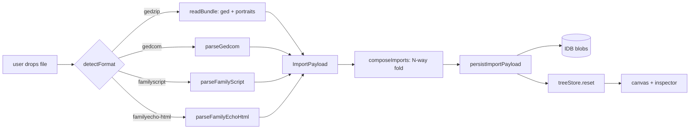

How a tree gets into the editor: supported formats, the wizard, the parse → persist pipeline, and what the parsers deliberately drop.

## supported formats

| format | extensions | source | reader | exports? |
|---|---|---|---|---|
| FamilyScript | `.txt` | Family Echo console | [familyscript/parse.ts](../../apps/web/src/lib/io/familyscript/parse.ts) | no (import-only) |
| GEDCOM 5.5 / 7 | `.ged`, `.gedcom` | most genealogy tools | [gedcom/parse.ts](../../apps/web/src/lib/io/gedcom/parse.ts) | no (import-only) |
| GEDZIP | `.gdz`, `.zip` | this editor + spec-compliant tools | [bundle/read.ts](../../apps/web/src/lib/io/bundle/read.ts) | yes (only export) |
| Family Echo HTML | `.html`, `.htm` | familyecho.com "save tree as HTML" | [familyecho-html/parse.ts](../../apps/web/src/lib/io/familyecho-html/parse.ts) | no (import-only) |

format detection: extension + magic bytes (zip header, first 256 chars). source of truth: [io/detect.ts](../../apps/web/src/lib/io/detect.ts).

## pipeline



every parser returns the same `ImportPayload` shape:

```ts
interface ImportPayload {
  tree: Tree;
  portraits: PortraitBlob[];   // empty unless the source carries images
  sourceFormat: ImportSourceFormat;
  count: number;
}
```

## where the code lives

| concern | file |
|---|---|
| format detection | [lib/io/detect.ts](../../apps/web/src/lib/io/detect.ts) |
| file → payload dispatcher | [lib/io/importFile.ts](../../apps/web/src/lib/io/importFile.ts) |
| FamilyScript parser | [lib/io/familyscript/parse.ts](../../apps/web/src/lib/io/familyscript/parse.ts) |
| FamilyScript tag tables (pedi codes, gender codes) | [lib/io/familyscript/tokens.ts](../../apps/web/src/lib/io/familyscript/tokens.ts) |
| GEDCOM parser | [lib/io/gedcom/parse.ts](../../apps/web/src/lib/io/gedcom/parse.ts) |
| GEDCOM serializer (round-trips Person slots) | [lib/io/gedcom/serialize.ts](../../apps/web/src/lib/io/gedcom/serialize.ts) |
| GEDZIP bundle reader (gedcom.ged + media/) | [lib/io/bundle/read.ts](../../apps/web/src/lib/io/bundle/read.ts) |
| GEDZIP bundle writer | [lib/io/bundle/write.ts](../../apps/web/src/lib/io/bundle/write.ts) |
| Family Echo HTML wrapper | [lib/io/familyecho-html/parse.ts](../../apps/web/src/lib/io/familyecho-html/parse.ts) |
| pairwise tree merge | [lib/io/merge/merge.ts](../../apps/web/src/lib/io/merge/merge.ts) |
| n-way fold over pairwise merge | [lib/io/import/composeImports.ts](../../apps/web/src/lib/io/import/composeImports.ts) |
| payload → IDB + treeStore.reset | [lib/io/persistImportPayload.ts](../../apps/web/src/lib/io/persistImportPayload.ts) |
| wizard UI | [lib/components/import/ImportWizard.svelte](../../apps/web/src/lib/components/import/ImportWizard.svelte) |
| wizard mount + canvas drag-drop wiring | [App.svelte](../../apps/web/src/App.svelte) (search `ImportWizard`) |

## import wizard

opens on `Mod+I` or the File > Import menu item, or by dragging a file onto the canvas. all imports go through the wizard: there is no silent path. user clarification baked in: "replace" means autosave the current tree first, then open the imported one (never deletes).

```
┌─────────────────────────────────────────────┐
│ import tree                              ×  │
├─────────────────────────────────────────────┤
│ ┌─────────────────────────────────────────┐ │
│ │  :arrow_up:  drop files here, or browse │ │
│ │  .txt  .ged  .gdz  .html                │ │
│ └─────────────────────────────────────────┘ │
│ ┌─────────────────────────────────────────┐ │
│ │ tiny.ged    [gedcom]  3 people       ×  │ │
│ │ Akarians.txt [familyscript] 1776 ppl ×  │ │
│ └─────────────────────────────────────────┘ │
│  tree name: [imported tree            ]     │
│  target:                                    │
│   ( ) save current and open the imported    │
│   (•) merge into the current tree           │
│                          [ cancel ][import] │
└─────────────────────────────────────────────┘
```

the replace/merge radio appears only when the active tree is `treeStore.dirty` (user-edited, not the placeholder seed). on a fresh session the wizard always replaces.

## family echo HTML specifics

the `.html` export from familyecho.com is self-contained: the full FamilyScript lives in a hidden `<input id="newscript" value="...">` and each portrait is a base64 data URI in a hidden ``. the FamilyScript `r<imageid> <w> <h>` tag on a person record keys the lookup. the wrapper:

1. parses the document via `DOMParser` (browser) / `jsdom` (tests)
2. hands the input value to `parseFamilyScript` (which captures `r` tags as person-extras)
3. decodes every `` data URI
4. matches each captured imageid to its bytes; produces a `PortraitBlob` per match
5. the imageid is consumed at import; it never appears on persisted `Person` records

no network and no `c=<share-code>` parameter is involved; the html is everything we need.

## multi-file merge composition

`composeImports(payloads[])` left-folds N payloads via the existing pairwise `mergeTrees`. fold order = drop order; identical inputs in the same order produce identical outputs (asserted in [composeImports.test.ts](../../apps/web/tests/unit/io/import/composeImports.test.ts)). when fold step k merges in payload k+1, the next step's portraits get their `personId` remapped through the merge's `bIdMap`. a portrait whose target is absent from the merge result is dropped silently rather than persisted to a ghost person.

if "merge into current" is selected, the active tree becomes the leftmost input.

## portrait persistence

`persistImportPayload` walks the payload's `portraits[]`, calls `putBlob` per blob into IDB, and links the returned blob id onto `person.portraitBlobId`. ext → mime mapping is in `persistImportPayload.ts`. orphan blobs from merge conflicts where the source loses are left in IDB; eager GC is on the deferred list. covered by [tests/unit/io/persistImportPayload.test.ts](../../apps/web/tests/unit/io/persistImportPayload.test.ts) and [tests/unit/io/familyecho-html/parse.test.ts](../../apps/web/tests/unit/io/familyecho-html/parse.test.ts).

## not implemented (and why)

the FamilyScript spec defines many tag families we deliberately do not parse: contact info (`e w B P t k u a C`), pet metadata (`R`), bio narrative (`o`), color labels (`G`), custom fields (`1`-`9`), couple lifecycle dates beyond marriage (`r b w t n y s d a f z`), couple type code (`g`), cause of death + burial details (`Z U F`), and extended date forms (ranges, before / after suffixes, 4-9 digit years). each is a sentence in the canonical gap list at [notes/to-do.md § family echo / familyscript coverage](../to-do.md#family-echo--familyscript-coverage).

three reasons items stay deferred:

- **no domain slot**: adding the slot requires a schema bump + a migration entry + GEDCOM mapping; the cost-benefit only pays out when a UI surface needs the value
- **rare in real exports**: the spec lists a lot of fields Family Echo's UI never produces
- **easy to add when needed**: every unmapped tag flows into `personExtras` / `coupleExtras` already, so a future phase reads the raw value rather than re-parsing

the FamilyScript serializer was retired in an earlier plan; there is no plan to bring it back. imports flow toward the canonical [GEDZIP `.gdz`](../agents.md#82-gedzip-as-the-only-export-format) on save. see [`agents.md` § 8.2](../agents.md#82-gedzip-as-the-only-export-format) for the rationale.

## adding a new import format

1. add the format discriminant to `FormatKind` in [detect.ts](../../apps/web/src/lib/io/detect.ts) and the extension / content sniff
2. write the parser; return an `ImportPayload`
3. route it in [importFile.ts](../../apps/web/src/lib/io/importFile.ts)
4. unit-test the parser against a fixture under [apps/web/tests/fixtures/](../../apps/web/tests/fixtures/)
5. the wizard, persistence, and merge composition all flow off `ImportPayload`; no UI changes needed

## see also

- [agents.md § 4](../agents.md) - layer map of `lib/io/` and `lib/domain/`
- [agents.md § 8](../agents.md) - permissive schema, export-only-GEDZIP, schemaVersion rules
- [to-do.md § family echo / familyscript coverage](../to-do.md) - canonical unmapped-tag list
- [bugs.md](../bugs.md) - open import-related bugs (search "import" or "wizard")

---

## metadata

```yaml
last_updated: 24 May 2026
```
